# System Architecture

## High-Level Architecture Diagram

```mermaid
flowchart TB
    %% External Actors
    User([Business User])
    Browser[Web Browser/Client]

    %% Main Entry Points
    User -->|Asks Questions| Browser
    Browser -->|HTTP Requests| API[FastAPI Application<br/>api.py]

    %% API Layer
    API -->|Health Checks| Health[Health Routes<br/>Status & Diagnostics]
    API -->|Query Requests| Agent[Agent Routes<br/>Process Questions]
    API -->|Configuration| Config[Config Routes<br/>View Settings]

    %% Core Application
    Agent -->|Initializes| App[Agent Application<br/>main.py<br/>Core Orchestrator]

    %% Business Logic Layer
    App -->|Configures| Configurator[Agent Configurator<br/>Setup & Coordination]

    %% Component Setup
    Configurator -->|1. Creates| LLM[AI Language Model<br/>OpenAI/Azure]
    Configurator -->|2. Connects| DB[Database Manager<br/>SQL Server Connection]
    Configurator -->|3. Prepares| Tools[Tools Manager<br/>Available Actions]
    Configurator -->|4. Builds| Prompt[Prompt Builder<br/>Instructions for AI]
    Configurator -->|5. Assembles| AgentFactory[Agent Factory<br/>Creates AI Agent]

    %% External Resources
    LLM -->|API Calls| OpenAI[(OpenAI/Azure<br/>AI Services)]
    DB -->|SQL Queries| Database[(SQL Server<br/>Business Data)]

    %% Tools Available
    Tools -->|Can Use| ToolsList[Available Tools:<br/>• Database Queries<br/>• Calculator<br/>• File Operations<br/>• Weather Info<br/>• System Info<br/>• HTTP Requests]

    %% Response Flow
    AgentFactory -->|Creates| FinalAgent[AI Agent Executor<br/>Answers Questions]
    FinalAgent -->|Formatted Response| Browser

    %% Configuration Files
    ConfigFiles[(Configuration Files)]
    ConfigFiles -.->|llm_config.json<br/>DB settings<br/>System prompt| Configurator

    %% Monitoring
    API -->|Tracks| Metrics[Telemetry & Monitoring<br/>Performance Metrics]

    %% Styling
    classDef userClass fill:#e1f5ff,stroke:#01579b,stroke-width:2px
    classDef apiClass fill:#fff9c4,stroke:#f57f17,stroke-width:2px
    classDef coreClass fill:#f3e5f5,stroke:#4a148c,stroke-width:2px
    classDef serviceClass fill:#e8f5e9,stroke:#1b5e20,stroke-width:2px
    classDef dataClass fill:#fce4ec,stroke:#880e4f,stroke-width:2px
    classDef toolClass fill:#e0f2f1,stroke:#004d40,stroke-width:2px

    class User,Browser userClass
    class API,Health,Agent,Config apiClass
    class App,Configurator,AgentFactory,FinalAgent coreClass
    class LLM,DB,Tools,Prompt,ToolsList serviceClass
    class OpenAI,Database,ConfigFiles dataClass
    class Metrics toolClass
```



## Business-Friendly Overview

### What This System Does

This is an **AI-powered Question-Answering System** that helps business users get information by asking questions in natural language.

### Key Components Explained

#### 1. **User Interface Layer**

- **What**: Web browser or any HTTP client
- **Purpose**: Where users type their questions
- **Example**: "What were our sales last month?" or "Calculate 15% of 1000"

#### 2. **API Application (api.py)**

- **What**: The main gateway to the system
- **Purpose**: Receives questions, routes them to the right handlers, and sends back answers
- **Like**: A receptionist directing visitors to the right department

#### 3. **Core Orchestrator (main.py - AgentApp)**

- **What**: The brain coordinator
- **Purpose**: Sets up all the pieces and makes sure they work together
- **Like**: A project manager ensuring all teams are ready

#### 4. **AI Language Model**

- **What**: OpenAI or Azure AI service
- **Purpose**: Understands questions and generates intelligent responses
- **Like**: A knowledgeable expert who understands what you're asking

#### 5. **Database Connection**

- **What**: Connection to your SQL Server database
- **Purpose**: Retrieves business data when needed
- **Like**: A librarian who can fetch specific books (data) from the library (database)

#### 6. **Tools Manager**

- **What**: Collection of capabilities the AI can use
- **Purpose**: Provides various actions the AI can perform
- **Available Tools**:
  - Query database for business data
  - Perform calculations
  - Check weather
  - Read/write files
  - Make web requests
  - Get system information

#### 7. **Configuration**

- **What**: Settings files that control behavior
- **Purpose**: Define which AI to use, database location, and system behavior
- **Files**:
  - `llm_config.json` - AI model settings
  - `.env` - Database credentials and API keys
  - `db_schema_config.json` - Database structure information

### How It Works (Step by Step)

1. **User asks a question** through their web browser
2. **API receives the question** and routes it to the Agent Routes
3. **Agent Configurator sets up everything needed**:
   - Connects to the AI service (OpenAI/Azure)
   - Connects to the database
   - Prepares available tools
   - Loads instructions for the AI
4. **AI Agent processes the question**:
   - Understands what's being asked
   - Decides which tools to use (e.g., query database, calculate)
   - Executes actions as needed
   - Formulates a clear answer
5. **Response sent back to user** with the answer

### Example Workflow

**User Question**: "What are the top 5 products by sales?"

1. Browser sends question to API
2. API forwards to Agent Routes
3. Agent uses Database Tool to query sales data
4. AI formats the results into readable answer
5. User receives: "Top 5 products are: Product A ($50k), Product B ($45k)..."

### Monitoring & Health

- **Health Checks**: System can report if it's working properly
- **Telemetry**: Tracks performance metrics (response times, errors)
- **Logging**: Records what happened for troubleshooting

### Security & Configuration

- API keys stored in `.env` file (never in code)
- Database credentials secured
- CORS enabled for web browser access
- Configurable timeouts and limits

## Technical Stack Summary

- **Framework**: FastAPI (Python web framework)
- **AI**: LangChain with OpenAI/Azure models
- **Database**: SQL Server (MSSQL)
- **Streaming**: LangServe for real-time responses
- **Configuration**: JSON and environment files
- **Monitoring**: Built-in telemetry and health checks

---

## Modern Agent Architecture - State of the Art (SOTA)

### How the Agent Works: ReAct Pattern with LangGraph


### Why This is State-of-the-Art (SOTA)

```mermaid
flowchart LR
    subgraph Old["❌ Old Approach (2022-2023)"]
        direction TB
        O1[Rule-Based Chatbots]
        O2[Fixed Response Trees]
        O3[No Tool Access]
        O4[Scripted Flows]

        O1 -.->|Limited| O2
        O2 -.->|Inflexible| O3
        O3 -.->|Can't adapt| O4
    end

    subgraph Modern["✅ Modern Approach (2024+)"]
        direction TB
        M1[LangGraph Framework]
        M2[ReAct Agent Pattern]
        M3[Function Calling]
        M4[Dynamic Reasoning]
        M5[Multi-Step Planning]
        M6[Memory & Context]

        M1 -->|Enables| M2
        M2 -->|Uses| M3
        M3 -->|Powers| M4
        M4 -->|Supports| M5
        M5 -->|With| M6
    end

    Old -.->|Evolution| Modern

    classDef oldStyle fill:#ffebee,stroke:#c62828,stroke-width:2px
    classDef newStyle fill:#e8f5e9,stroke:#2e7d32,stroke-width:3px

    class O1,O2,O3,O4 oldStyle
    class M1,M2,M3,M4,M5,M6 newStyle
```



### Key SOTA Features Explained

#### 1. **ReAct Pattern (Reason + Act)**


**Why Better:**

- 🧠 **Thinks before acting** (not random tool calls)
- 🔄 **Self-correcting** (learns from observations)
- 📊 **Multi-step reasoning** (can chain actions)
- ✅ **Validates results** (checks if answer is complete)

#### 2. **Native Function Calling**

**Traditional (Old):**

```
User: "Calculate 15% of sales"
Bot: "I don't understand. Try rephrasing."
```

**Modern (SOTA):**

```
User: "Calculate 15% of sales"
Agent:
  1. THINK: Need sales data, then calculate
  2. ACT: Query database → $10,000
  3. OBSERVE: Got $10,000
  4. THINK: Now calculate 15%
  5. ACT: calculator_tool(10000 * 0.15)
  6. OBSERVE: Result = $1,500
  7. ANSWER: "15% of sales is $1,500"
```

#### 3. **LangGraph State Machine**


**Advantages:**

- ✅ **Predictable execution flow**
- ✅ **Easy to debug and visualize**
- ✅ **Can save/resume conversations**
- ✅ **Built-in error recovery**

#### 4. **Comparison: Traditional vs SOTA**

| Feature              | Traditional Chatbot | SOTA Agent (Our System)    |
| -------------------- | ------------------- | -------------------------- |
| **Intelligence**     | Pattern matching    | LLM reasoning              |
| **Data Access**      | Pre-programmed only | Real-time database queries |
| **Calculation**      | Fixed formulas      | Dynamic calculations       |
| **Adaptability**     | Must reprogram      | Learns from tools          |
| **Multi-step**       | Single response     | Chain of actions           |
| **Memory**           | No context          | Remembers conversation     |
| **Error Handling**   | Breaks easily       | Self-correcting            |
| **Tool Integration** | Hard-coded          | Plug-and-play tools        |

### Real-World Example

**Question:** "Compare last month's sales to this month and calculate the growth percentage"

**Agent Process:**


### Why This Matters for Business

#### Traditional Limitations:

- ❌ "I can only answer predefined questions"
- ❌ "I can't access your database"
- ❌ "I can't do calculations"
- ❌ "I forget previous messages"

#### SOTA Benefits:

- ✅ **Understands intent** - Natural language, any phrasing
- ✅ **Accesses live data** - Real-time database queries
- ✅ **Performs calculations** - Mathematical operations
- ✅ **Chains actions** - Multi-step problem solving
- ✅ **Remembers context** - Conversation history
- ✅ **Self-validates** - Checks if answer makes sense

### Technical Innovation Stack


### Summary: Why This is Cutting-Edge

1. **2024+ Best Practices**: Uses latest LangGraph framework (released 2024)
2. **OpenAI Function Calling**: Native tool integration (most advanced capability)
3. **ReAct Pattern**: Research-proven reasoning method
4. **Production-Ready**: Used by companies like Microsoft, Google, Stripe
5. **Scalable Architecture**: Can handle millions of requests
6. **Extensible**: Easy to add new tools and capabilities

This isn't just a chatbot - it's an **intelligent agent that reasons, acts, and learns**.
