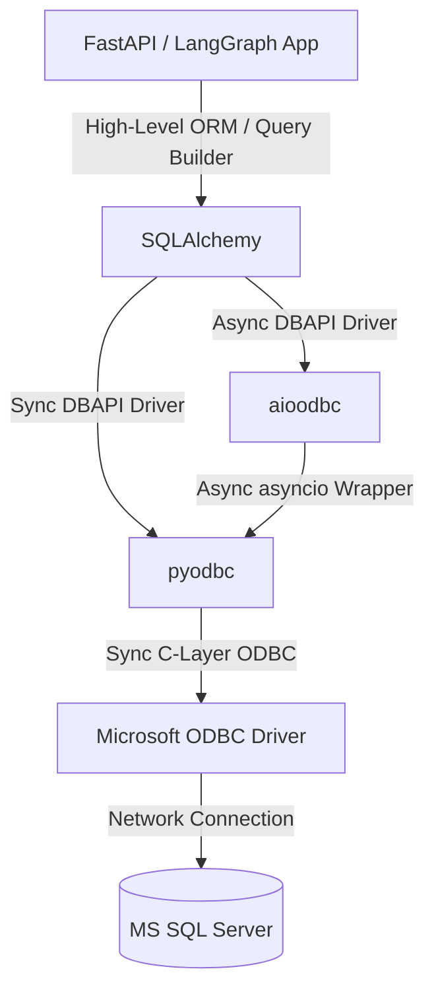

# Database Library Confrontation: SQLAlchemy vs. pyodbc vs. aioodbc

This document evaluates **SQLAlchemy**, **pyodbc**, and **aioodbc** for the **MyLangHello** project (a FastAPI + LangGraph chatbot agent). It compares their architectures, details their pros and cons, and explains what is best suited for your specific codebase.

---

## 1. Understanding the Database Stack

To compare these libraries, it is important to understand that they operate at different layers of the database connectivity stack:



*   **pyodbc**: A low-level, synchronous, C-based driver (DBAPI) that establishes a direct connection to SQL Server via Microsoft's ODBC driver.
*   **aioodbc**: An asynchronous wrapper around `pyodbc` that allows database operations to be awaited using Python's `asyncio` event loop.
*   **SQLAlchemy**: A high-level database toolkit and Object-Relational Mapper (ORM). It **requires** a driver under the hood (like `pyodbc` or `aioodbc`) to actually talk to the database.

---

## 2. Library Comparison: Pros & Cons

### A. pyodbc (Low-Level Synchronous Driver)
Directly executes raw SQL queries using synchronous blocking calls.

*   **Pros:**
    *   **Performance:** Extremely lightweight with minimal CPU/memory overhead.
    *   **Simple Setup:** No ORM mapping layer to learn; you write raw SQL exactly as you would in SQL Server Management Studio (SSMS).
*   **Cons:**
    *   **Blocking:** Every database query blocks the thread. In a FastAPI context, this can stall the event loop under heavy concurrent load.
    *   **Boilerplate:** Requires manual management of connections, cursors, transactions (`try...except...finally` blocks), and results mapping (tuples to dictionaries).
    *   **No SQL Generation:** Vulnerable to SQL injection if parameterization is handled incorrectly. Moving to another database type (e.g., PostgreSQL) requires rewriting SQL queries.
    *   **No LangChain Integration:** LangChain's SQL agents cannot utilize pyodbc directly without writing manual wrappers for schema discovery and execution.

### B. aioodbc (Low-Level Asynchronous Driver)
Asynchronous wrapper for `pyodbc` designed for `asyncio` applications.

*   **Pros:**
    *   **Non-Blocking:** Awaiting queries allows FastAPI to handle other API requests concurrently, greatly improving throughput.
*   **Cons:**
    *   **Thread Overhead:** Because the underlying ODBC driver and `pyodbc` are synchronous, `aioodbc` runs calls in a thread pool executor under the hood.
    *   **Boilerplate:** Still requires low-level manual connection/cursor handling and SQL string formatting.
    *   **Niche Ecosystem:** Fewer community tools and extensions compared to SQLAlchemy.

### C. SQLAlchemy (High-Level ORM & Toolkit)
The industry standard database toolkit. It can run in synchronous mode (using `pyodbc` as `mssql+pyodbc://`) or asynchronous mode (using `aioodbc` as `mssql+aioodbc://`).

*   **Pros:**
    *   **LangChain / SQLDatabaseToolkit Integration (Critical):** LangChain's SQL tools are built entirely around SQLAlchemy's `Engine` and schema reflection. It uses reflection to dynamically teach the LLM about your tables, types, and relationships.
    *   **Safety & Security:** Automatic SQL injection prevention through query parameterization and transaction safety via context managers.
    *   **Connection Pooling:** Built-in connection management (reconnects, recycling stale connections, timeouts).
    *   **Flexibility:** Allows writing raw SQL (`text()`), building SQL programmatically (SQLAlchemy Core), or mapping to Python objects (ORM).
    *   **Portability:** Database-agnostic dialect system. Switch database engines by changing the URI.
*   **Cons:**
    *   **Learning Curve:** Complex features (relationships, session lifecycle, caching, migrations via Alembic).
    *   **Minor Performance Overhead:** Slightly slower than raw `pyodbc` due to Python object mapping and SQL translation (rarely a bottleneck in LLM applications).

---

## 3. Confronting Your Project (MyLangHello)

Here is how the choice affects the different parts of **MyLangHello**:

### Feature 1: The LangGraph AI Agent (`services/agent_factory.py`)
Your AI Agent dynamically queries the database via LangChain's `SQLDatabaseToolkit`:
```python
toolkit = SQLDatabaseToolkit(
    db=SQLDatabase.from_uri(conn_str), # Uses SQLAlchemy under the hood
    llm=self.llm
)
```
*   **Verdict:** **SQLAlchemy is mandatory here.** LangChain's `SQLDatabase` wrapper *requires* a SQLAlchemy connection URI or Engine. It uses SQLAlchemy to retrieve schema details (table structures, types) to pass to the LLM. 
*   If you wanted to use raw `pyodbc`, you would have to write custom LangGraph tools to list tables, query schemas, and check queries. This would require reproducing hundreds of lines of LangChain code.

### Feature 2: FastAPI Routing (`api.py` & `routes/agent_routes.py`)
Your API endpoints are defined asynchronously (`async def query_agent`).
*   **Verdict:** While FastAPI is async, LangChain's default database tools run **synchronously** because LLM reasoning steps are inherently sequential.
*   **Sync SQLAlchemy (`mssql+pyodbc`)** is perfectly fine for your current agent. Because the LLM generation itself is a slow network operation, the blocking database call has negligible impact.
*   If you build custom endpoints that do high-frequency queries outside the LLM flow, you can switch to **Async SQLAlchemy (`mssql+aioodbc`)** for those routes to avoid blocking the event loop.

### Feature 3: Schema Diagnostics (`check_cb.py`)
This script checks permissions and table schemas:
```python
engine = create_engine(conn_str)
with engine.connect() as conn:
    result = conn.execute(text("SELECT SCHEMA_NAME FROM ..."))
```
*   **Verdict:** **SQLAlchemy with raw SQL (`text()`)** is the cleanest approach here. It handles connection pooling and cleaning up connection resources automatically through context managers. Using `pyodbc` directly would require writing a custom wrapper to fetch and map rows safely.

---

## 4. Final Recommendation

| Component | Recommended Technology | Rationale |
| :--- | :--- | :--- |
| **LangGraph SQL Tools** | **SQLAlchemy (`mssql+pyodbc://`)** | Direct out-of-the-box integration with LangChain. Extremely robust schema reflection. |
| **Diagnostic Scripts** | **SQLAlchemy (`text(...)`)** | Provides connection pooling and auto-cleanup. No need to write connection management boilerplate. |
| **High-Scale API Endpoints** (Non-LLM) | **SQLAlchemy Async (`mssql+aioodbc://`)** | Keeps your FastAPI event loop non-blocking under heavy concurrent user traffic. |

### Summary
*   **Do not replace SQLAlchemy.** It is the backbone of your agent's SQL toolkit and database connection management.
*   **Keep using `pyodbc` as the driver.** It is the most stable and performant driver for SQL Server in Python.
*   **Consider `aioodbc` only if you need to run high-volume, non-agent database queries asynchronously** in your FastAPI endpoints. If you do, use it **via SQLAlchemy's Async API** (`create_async_engine` and `mssql+aioodbc://`) rather than raw `aioodbc` to retain the benefits of connection pooling and transaction security.

---

## 5. Can I just switch connection strings to use `aioodbc`?

**No, you cannot simply install the package and replace the connection string.** Doing so will break the application immediately. Here is why:

### A. LangChain's SQLDatabase toolkit is synchronous
In `services/agent_factory.py`, the toolkit is initialized using:
```python
db=SQLDatabase.from_uri(database_uri=conn_str)
```
If you pass an async connection string like `mssql+aioodbc://` here, LangChain will try to run synchronous reflection queries against it. This will immediately raise a `RuntimeError` or `TypeError` because you cannot run async drivers synchronously.

### B. SQLAlchemy syntax must change for async
You cannot use standard synchronous methods with an async driver. You must change the initialization function and use Python's `async/await` syntax for every connection and execution step.

#### Synchronous Connection (Current `pyodbc`):
```python
from sqlalchemy import create_engine, text

# Sync engine
engine = create_engine("mssql+pyodbc://...")

with engine.connect() as conn:
    result = conn.execute(text("SELECT * FROM users"))
    rows = result.fetchall()
```

#### Asynchronous Connection (Required for `aioodbc`):
```python
from sqlalchemy.ext.asyncio import create_async_engine
from sqlalchemy import text

# 1. Must use create_async_engine
engine = create_async_engine("mssql+aioodbc://...")

# 2. Must use async context manager and await execution
async def fetch_data():
    async with engine.connect() as conn:
        result = await conn.execute(text("SELECT * FROM users"))
        rows = result.fetchall()
```

### Conclusion
A driver switch requires **rewriting any code that interacts with the engine to use `async/await`** and bypassing LangChain's default synchronous `SQLDatabase` wrappers. Do not switch unless you are writing custom, high-concurrency routes separate from the LLM agent.

